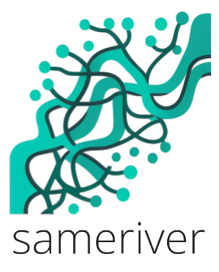

> Heraclitus of Ephesus (/ˌhɛrəˈklaɪtəs/;[1] Greek: Ἡράκλειτος ὁ Ἐφέσιος
> Hērákleitos ho Ephésios; c. 535 – c. 475 BC) was a pre-Socratic Greek
> philosopher, and a native of the city of Ephesus,[2] then part of
> the Persian Empire.
>
> Heraclitus was famous for his insistence on ever-present change as
> being the fundamental essence of the universe, as stated in the famous
> saying, "No man ever steps in the same river twice"[6] (see panta rhei
> below). This position was complemented by his stark commitment to
> a unity of opposites in the world, stating that "the path up and down
> are one and the same". Through these doctrines Heraclitus characterized all
> existing entities by pairs of contrary properties, whereby no entity may
> ever occupy a single state at a single time. This, along with his cryptic
> utterance that "all entities come to be in accordance with this Logos
> " (literally, "word", "reason", or "account") has been the subject of
> numerous interpretations.

---

### 0. What is it?

A game engine written in Go.

### 1. Development

Run `make` to build and test.

Dependencies can be installed by `make deps`.

### 2. Dependencies

apt:

* `libsdl2{,-mixer,-image,-ttf,-gfx}-dev`

pacman:

* `sdl2{,_mixer,_image,_ttf,_gfx}`

windows: mingw env packages (install from source)

* `SDL2-devel-2.0.5-mingw.tar.gz`
* `SDL2_image-devel-2.0.1-mingw.tar.gz`
* `SDL2_mixer-devel-2.0.1-mingw.tar.gz`
* `SDL2_ttf-devel-2.0.14-mingw.tar.gz`

### 3. Technical details

#### 3.a. General engine design

##### 3.a.i. entity component system

The engine is built on an "entity-component-system" architecture, in which:

**Components** are collections of a certain type of data indexed by the ID's of entities. For example, the velocity component is a `[MAX_ENTITIES]Vec2D`. -- see `component_table.go`

**Entities** are conceptually an ID which indexes the component data, and Logics that run every `World.Update()`, and Funcs that can be called by string-name (entities can be active or inactive) -- see `entity.go`

**Systems** are collections of logic which run every World.Update() and usually operate on subsets of entities selected for by an arbitrary query -- see `collision_system.go` for an example system (Users can also define and provide their own systems by implementing the `System` interface)

There are also some **Managers** which are sort of like the glue holding the engine together, or providing services.

The **`EntityManager`** is a particularly important central part of the engine. - see `entity_manager.go`, `entity_manager_spawn.go`, etc.

##### 3.a.ii. scenes

The engine is also built on a "scene-based" architecture, in which:

**Scenes** are loaded into the `Game` object's loop, and have control over input and display while they're running.

All scenes will be registered and stored with the singleton Game object, and can refer to each other by name (strings).

The currently running scene is updated each game loop iteration, receiving:

* keyboard state via a call to a `HandleKeyboardState (keyboard_state []uint8)` method
* delta-time updates via a call to an `Update (dt_ms float64, allowance_ms float64)` method (allowance_ms should be passed to `World.Update()` if this scene is using a World)
* a call to a `Draw (window *sdl.Window, renderer *sdl.Renderer)` method.

Scenes are initialized and loaded in the background while a singleton loading scene will be displayed until the new scene is ready to take over.

##### 3.a.iii. worlds

Worlds are where the magic actually happens. 

You call World.RegisterComponents() and World.RegisterSystems() to set up the entity-components and the systems that will run.

You can call World.AddLogic() to add world logic funcs (Logic funcs will receive (dt_ms float64) where dt_ms is the ms since the func last ran)

Your scene should call `World.Update(allowance_ms)` every `Scene.Update()`.

See world.go for the full suite of functions available.
